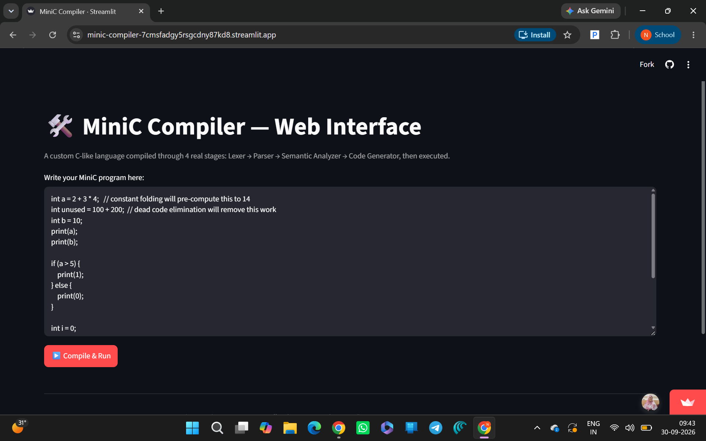
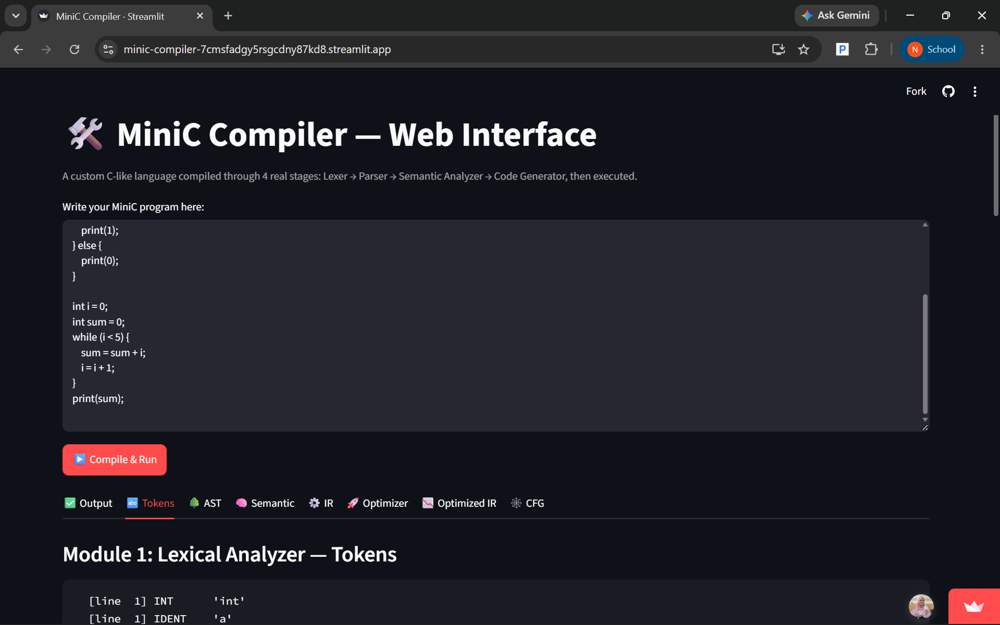
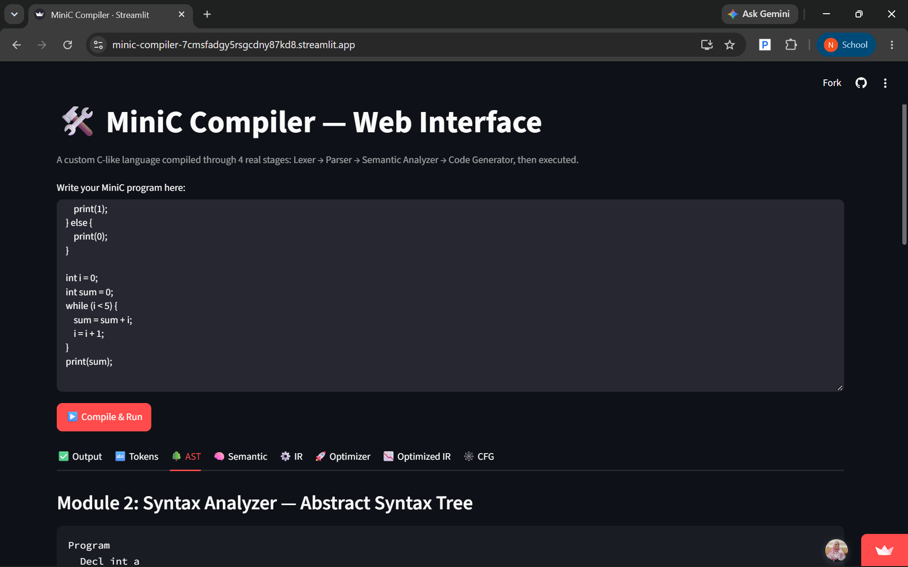
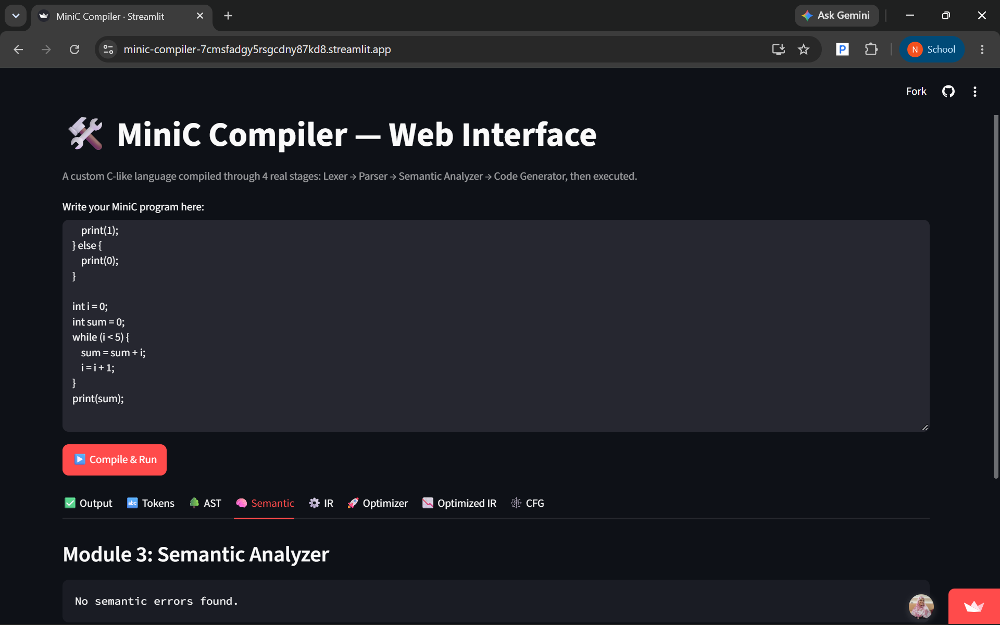
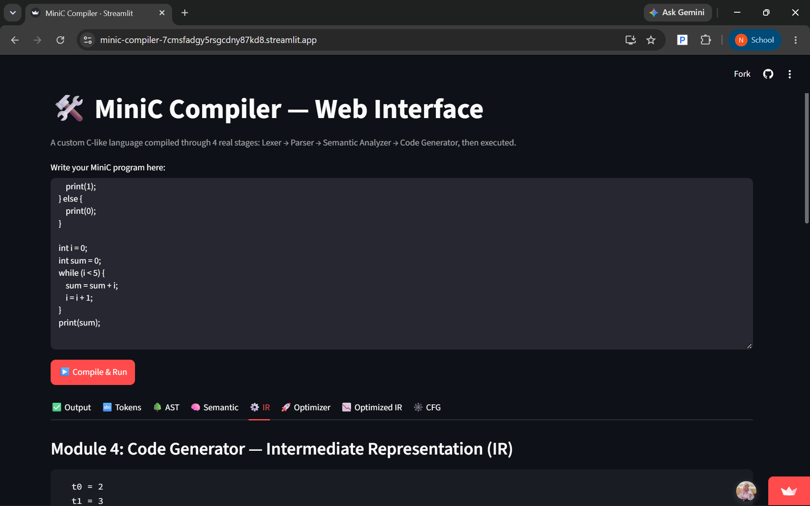
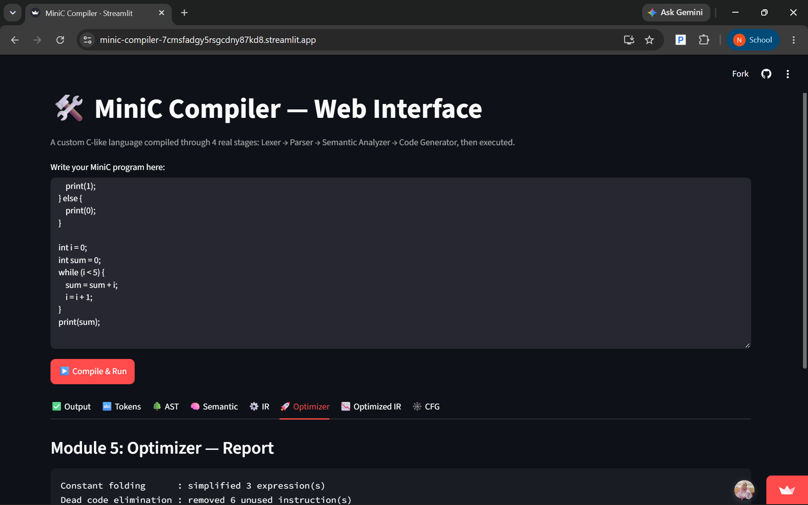
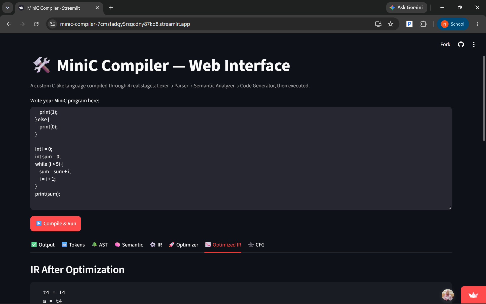
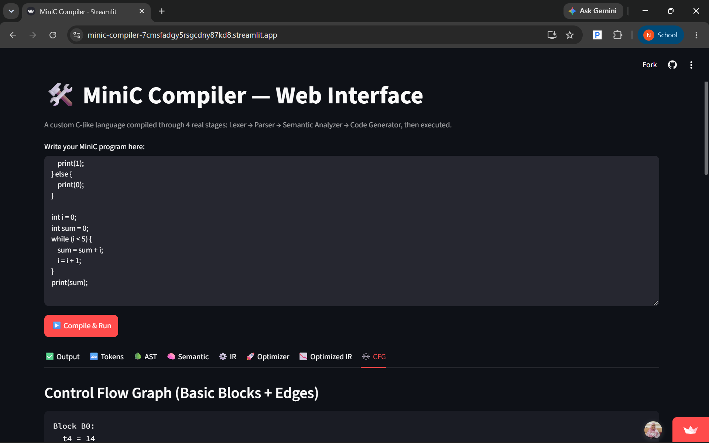
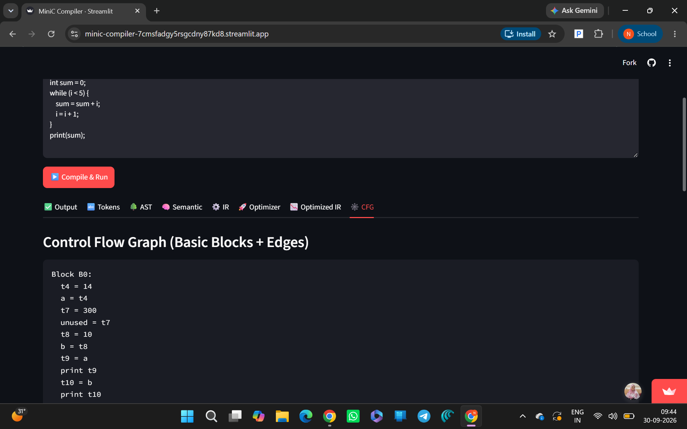

# ⚡ MiniC Compiler

### A modular C-like compiler built from scratch — from source code to optimized IR and Virtual Machine execution.

<p align="center">
  
  
  
  
  
  
</p>

<p align="center">
  <b>Lexer → Parser → AST → Semantic Analysis → TAC → Optimization → CFG → Virtual Machine</b>
</p>

<p align="center">
  <a href="https://github.com/N230881/MiniC-Compiler">GitHub Repository</a>
</p>

---

## 🚀 Live Demo

<p align="center">

<a href="https://minic-compiler-7cmsfadgy5rsgcdny87kd8.streamlit.app/">
  
</a>

</p>

> **Try the MiniC Compiler directly in your browser.**
>
> Write MiniC code, compile it, and explore the complete compilation pipeline including **Tokens, AST, Semantic Analysis, TAC/IR, Optimized IR, CFG, and Virtual Machine output**.

🔗 **[Launch MiniC Compiler →](https://minic-compiler-7cmsfadgy5rsgcdny87kd8.streamlit.app/)**

---


## 🎬 Demo Video

See the MiniC Compiler in action, including the interactive web interface, compilation stages, optimization, program execution, and error handling.


The demo showcases the Streamlit-based Compiler Explorer and demonstrates how MiniC processes source code through its compilation pipeline.


## 📸 Compiler Explorer

The project includes an interactive **Streamlit Compiler Explorer** for visualizing the complete compilation pipeline.

### 🖥️ Compiler Interface



### 🔤 Lexical Analysis — Tokens



### 🌳 Syntax Analysis — AST



### 🧠 Semantic Analysis



### ⚙️ Intermediate Representation



### 🚀 Optimization



### 📉 Optimized IR



### 🕸️ Control Flow Graph



### ✅ Program Output



---
## 🌐 Try It Online

| Resource                       | Link                                                                                                              |
| ------------------------------ | ----------------------------------------------------------------------------------------------------------------- |
| 🚀 **Live Compiler**           | [Open Streamlit App](https://minic-compiler-7cmsfadgy5rsgcdny87kd8.streamlit.app/)                                |
| 💻 **Source Code**             | [GitHub Repository](https://github.com/N230881/MiniC-Compiler)                                                    |
| 📚 **Technical Documentation** | [Compiler Construction Guide](https://github.com/N230881/MiniC-Compiler/blob/main/Compiler_Construction_Guide.md) | 


## 🚀 What is MiniC?

**MiniC** is a compiler implementation for a small C-like programming language, built from scratch in **C** to demonstrate the core architecture and engineering principles behind modern compilers.

Unlike a simple parser or interpreter, MiniC implements a complete compilation pipeline:

```text
                   ┌────────────────────┐
                   │    MiniC Source    │
                   │       (.mc)        │
                   └─────────┬──────────┘
                             │
                             ▼
                   ┌────────────────────┐
                   │       LEXER        │
                   │   Source → Tokens  │
                   └─────────┬──────────┘
                             │
                             ▼
                   ┌────────────────────┐
                   │      PARSER        │
                   │   Tokens → AST     │
                   └─────────┬──────────┘
                             │
                             ▼
                   ┌────────────────────┐
                   │ SEMANTIC ANALYSIS  │
                   │ Symbol / Validity  │
                   └─────────┬──────────┘
                             │
                             ▼
                   ┌────────────────────┐
                   │    TAC / IR        │
                   │ AST → Intermediate │
                   └─────────┬──────────┘
                             │
                             ▼
                   ┌────────────────────┐
                   │     OPTIMIZER      │
                   │ Folding + DCE      │
                   └─────────┬──────────┘
                             │
                             ▼
                   ┌────────────────────┐
                   │       CFG          │
                   │ Blocks + Edges     │
                   └─────────┬──────────┘
                             │
                             ▼
                   ┌────────────────────┐
                   │   VIRTUAL MACHINE  │
                   │    IR Execution    │
                   └─────────┬──────────┘
                             │
                             ▼
                   ┌────────────────────┐
                   │       OUTPUT       │
                   └────────────────────┘
````

The project also includes an interactive **Streamlit compiler explorer**, allowing users to inspect the output of each compiler stage directly in the browser.

---

# 💡 Why This Project?

MiniC was designed around a simple principle:

> **Don't hide the compiler. Expose it.**

A source program can be inspected at every major transformation:

```text
Source
  ↓
Tokens
  ↓
AST
  ↓
Semantic Information
  ↓
Three-Address Code
  ↓
Optimized Three-Address Code
  ↓
Control Flow Graph
  ↓
Virtual Machine Execution
```

This makes MiniC both a compiler implementation and an interactive environment for understanding compiler internals.

---

# ✨ Core Capabilities

<table>
<tr>
<td width="50%">

### 🔤 Front End

* Hand-written lexical analyzer
* Recursive-descent parser
* Abstract Syntax Tree
* Symbol-table based semantic analysis
* Line-aware diagnostics

</td>

<td width="50%">

### ⚙️ Intermediate Representation

* Three-Address Code
* Temporary generation
* Label generation
* Explicit control flow
* Structured IR instructions

</td>
</tr>

<tr>
<td>

### 🚀 Optimization

* Constant folding
* Dead code elimination
* Optimization statistics
* Optimized IR generation

</td>

<td>

### 🧠 Program Analysis

* Basic-block construction
* Control Flow Graph generation
* Branch analysis
* Leader identification

</td>
</tr>

<tr>
<td>

### 🖥️ Execution

* Custom Virtual Machine
* Runtime variable storage
* Temporary registers
* Arithmetic operations
* Conditional/unconditional jumps

</td>

<td>

### 🌐 Developer Experience

* Streamlit compiler explorer
* Stage-by-stage visualization
* Built-in test programs
* Execution timeout protection
* Structured compiler diagnostics

</td>
</tr>
</table>

---

# 🧩 Compiler Architecture

The implementation is intentionally modular.

| Component     | Responsibility                          |
| ------------- | --------------------------------------- |
| `lexer.c`     | Source code → tokens                    |
| `parser.c`    | Tokens → AST                            |
| `ast.c`       | AST representation and utilities        |
| `semantic.c`  | Semantic validation and symbol checking |
| `codegen.c`   | AST → Three-Address Code                |
| `optimizer.c` | IR optimization                         |
| `cfg.c`       | Basic blocks and CFG construction       |
| `ops.c`       | Shared operator semantics               |
| `vm.c`        | Optimized IR execution                  |
| `main.c`      | Compiler pipeline orchestration         |
| `app.py`      | Interactive Streamlit interface         |

This separation keeps compiler stages independent and makes the system easier to understand and extend.

---

# 🔬 Compilation Pipeline

## 01 — Lexical Analysis

The lexer converts raw MiniC source code into a stream of tokens.

It recognizes:

* Keywords
* Identifiers
* Integer literals
* Arithmetic operators
* Relational operators
* Logical operators
* Punctuation
* End-of-file

Example:

```c
int x = 10;
```

Conceptually becomes:

```text
INT
IDENT(x)
ASSIGN
NUM(10)
SEMICOLON
```

Token line information is retained so later compiler stages can provide useful diagnostics.

---

# 02 — Parsing

MiniC uses a **recursive-descent parser** to transform tokens into an Abstract Syntax Tree.

The AST represents constructs such as:

```text
N_NUM
N_VAR
N_BINOP
N_UNOP
N_ASSIGN
N_DECL
N_IF
N_WHILE
N_FOR
N_PRINT
N_BLOCK
N_PROGRAM
```

Operator precedence is handled during expression parsing.

For:

```c
x + y * 2
```

the AST represents:

```text
       +
      / \
     x   *
        / \
       y   2
```

rather than incorrectly evaluating:

```text
(x + y) * 2
```

---

# 03 — Semantic Analysis

Parsing determines whether a program has the correct structure.

Semantic analysis determines whether that structurally valid program actually makes sense.

The semantic analyzer performs checks including:

* Declaration validation
* Duplicate declaration detection
* Use-before-declaration detection
* Expression validation
* Statement validation

A symbol table tracks declared variables and their associated information.

---

# 04 — Three-Address Code

After semantic validation, the AST is lowered into **Three-Address Code (TAC)**.

TAC breaks complex expressions into simple operations involving temporary values.

For example:

```c
int result = a + b * 2;
```

can be represented conceptually as:

```text
t1 = 2
t2 = b * t1
t3 = a + t2
result = t3
```

This creates a clean boundary between the high-level language and the execution engine.

---

# 05 — Optimization

MiniC currently implements two important optimization techniques.

### Constant Folding

Compile-time evaluation of expressions whose operands are known constants.

```text
2 + 3 * 4
```

becomes:

```text
14
```

before runtime.

### Dead Code Elimination

Computations whose results are never used can be removed from the IR.

For example:

```c
int unused = 100 + 200;
int x = 10;

print(x);
```

does not need to retain the computation for `unused`.

---

# 06 — Control Flow Graph

The optimized IR is divided into **basic blocks**.

A basic block has:

* A single entry point
* Sequential execution
* A controlled exit

MiniC identifies leaders such as:

* The first instruction
* Jump targets
* Instructions immediately following jumps

These blocks are then connected to form a **Control Flow Graph**.

Example:

```text
                    ┌──────────────┐
                    │    Entry     │
                    └──────┬───────┘
                           │
                       condition
                      /           \
                     ▼             ▼
             ┌────────────┐  ┌────────────┐
             │    THEN    │  │    ELSE    │
             └─────┬──────┘  └──────┬─────┘
                   │                │
                   └───────┬────────┘
                           ▼
                    ┌──────────────┐
                    │     EXIT     │
                    └──────────────┘
```

This exposes the program's control structure in a form commonly used for compiler analysis and optimization.

---

# 07 — Virtual Machine

MiniC does **not** generate native machine code.

Instead, the optimized TAC is executed by a custom **Virtual Machine**.

The VM maintains:

```text
Program Counter
Temporary Registers
Variables
Labels
Runtime State
```

It interprets operations such as:

```text
LOADCONST
LOADVAR
STOREVAR
BINOP
UNOP
PRINT
LABEL
GOTO
IFFALSE_GOTO
```

This creates a clean backend for experimenting with generated IR without requiring a native machine-code generator.

---

# 🔁 Shared Operator Semantics

Operator behavior is centralized in:

```text
ops.c
ops.h
```

and reused by both the optimizer and the virtual machine.

```text
                ┌──────────────┐
                │   Operator   │
                │    Engine    │
                └──────┬───────┘
                       │
             ┌─────────┴─────────┐
             ▼                   ▼
      ┌──────────────┐    ┌──────────────┐
      │  Optimizer   │    │      VM      │
      │ Compile-time │    │   Runtime    │
      └──────────────┘    └──────────────┘
```

This avoids maintaining separate implementations of arithmetic and logical semantics across compiler stages.

---

# 🌐 Interactive Compiler Explorer

The project includes a **Streamlit-based web interface** for interacting with the compiler.

Run:

```bash
streamlit run app.py
```

The interface allows users to write MiniC code and inspect the compiler pipeline.

### Compiler Views

| View            | Information             |
| --------------- | ----------------------- |
| 🔤 Tokens       | Lexer output            |
| 🌳 AST          | Parsed syntax tree      |
| 🧠 Semantic     | Semantic analysis       |
| ⚙️ IR           | Generated TAC           |
| 🚀 Optimizer    | Optimization statistics |
| 📉 Optimized IR | Optimized TAC           |
| 🕸️ CFG         | Basic blocks and edges  |
| ✅ Output        | Program execution       |

---


# 💻 MiniC Language

MiniC intentionally implements a compact C-like syntax.

## Data Type

```c
int
```

## Variables

```c
int x = 10;
x = x + 1;
```

## Arithmetic

```text
+
-
*
/
```

## Comparisons

```text
<
>
<=
>=
==
!=
```

## Conditional Statements

```c
if (x > 10) {
    print(x);
} else {
    print(0);
}
```

## While Loop

```c
while (x < 10) {
    x = x + 1;
}
```

## For Loop

```c
for (int i = 0; i < 5; i = i + 1) {
    print(i);
}
```

## Output

```c
print(x);
```

---

# 🧪 Example

### MiniC Source

```c
int a = 10;
int b = 20;

print(a + b);
```

### Compile

```bash
./minicompiler tests/mytest.mc
```

### Output

```text
===TOKENS===

===AST===

===SEMANTIC===

===IR===

===OPTIMIZER===

===OPTIMIZED_IR===

===CFG===

===OUTPUT===
30

===END===
```

The compiler therefore exposes the complete transformation instead of returning only the final result.

---

````markdown
# 📁 Repository Structure

```text
MiniC-Compiler/
│
├── lexer.c
├── lexer.h
├── token.h
│
├── parser.c
├── parser.h
│
├── ast.c
├── ast.h
│
├── semantic.c
├── semantic.h
│
├── codegen.c
├── codegen.h
│
├── optimizer.c
├── optimizer.h
│
├── cfg.c
├── cfg.h
│
├── ops.c
├── ops.h
│
├── vm.c
├── vm.h
│
├── main.c
│
├── app.py
├── requirements.txt
│
├── docs/
│   ├── 01-home.png
│   ├── 02-tokens.png
│   ├── 03-ast.png
│   ├── 04-semantic.png
│   ├── 05-ir.png
│   ├── 06-optimizer.png
│   ├── 07-optimized-ir.png
│   ├── 08-cfg.png
│   └── 09-output.png
│
├── tests/
│   ├── test1.mc
│   └── test2_optimizer.mc
│
├── Compiler_Construction_Guide.md
│
├── LICENSE
│
├── README.md
│
└── minicompiler
````

---

# ⚙️ Installation

## Requirements

* GCC
* Python 3
* pip
* Streamlit

### Clone

```bash
git clone https://github.com/N230881/MiniC-Compiler.git
cd MiniC-Compiler
```

### Build

```bash
gcc -Wall -o minicompiler *.c
```

On Windows/MinGW:

```bash
gcc -Wall -o minicompiler.exe *.c
```

---

# ▶️ Run

Linux/macOS:

```bash
./minicompiler tests/test1.mc
```

Windows:

```text
minicompiler.exe tests\test1.mc
```

---

# 🌐 Launch the Web UI

Install the required dependencies:

```bash
pip install -r requirements.txt
```

Start the Streamlit application:

```bash
streamlit run app.py
```

Then open:

```text
http://localhost:8501
```

---


# 🧪 Test Programs

The repository includes test programs designed to exercise different compiler stages.

## `test1.mc`

Exercises:

* Variable declarations
* Initialization
* Arithmetic
* Operator precedence
* Conditional statements
* Loops
* Printing

## `test2_optimizer.mc`

Exercises:

* Constant folding
* Dead code elimination
* Optimized IR
* Conditional execution
* VM execution
* Optimizer statistics

Run:

```bash
./minicompiler tests/test1.mc
./minicompiler tests/test2_optimizer.mc
```

---

# 📊 Engineering Highlights

MiniC demonstrates practical implementation of:

```text
✓ Lexical Analysis
✓ Recursive-Descent Parsing
✓ Abstract Syntax Trees
✓ Symbol Tables
✓ Semantic Analysis
✓ Three-Address Code
✓ Temporary / Label Generation
✓ Constant Folding
✓ Dead Code Elimination
✓ Basic Blocks
✓ Control Flow Graphs
✓ Custom Virtual Machine
✓ Runtime Interpretation
✓ Structured Diagnostics
✓ Streamlit Visualization
```

---

# 🧠 Technical Design Principles

### Separation of Concerns

Each compiler stage has a focused responsibility.

### Explicit Intermediate Representation

TAC provides a simple and inspectable bridge between the AST and execution.

### Reusable Semantics

Operator behavior is centralized instead of duplicated.

### Observable Compilation

Every major compiler transformation can be inspected.

### Extensibility

The modular architecture makes future additions—new language constructs, optimizations, or backends—easier to implement.

---

# ⚠️ Scope

MiniC is intentionally an **educational compiler implementation**, not a production C compiler.

It currently focuses on:

* Integer-based computation
* Compact C-like syntax
* Compiler pipeline fundamentals
* IR generation
* Basic optimization
* CFG construction
* VM execution

It does not currently provide native machine-code generation, LLVM lowering, or the complete C language.

The goal is to make compiler internals **understandable, executable, and inspectable** rather than reproduce GCC or Clang.

---

# 🛣️ Roadmap

## Language

* [ ] Additional primitive types
* [ ] Arrays
* [ ] Functions
* [ ] Return statements
* [ ] Nested scopes
* [ ] Strings
* [ ] Expanded standard library

## Optimization

* [ ] Constant propagation
* [ ] Copy propagation
* [ ] Common subexpression elimination
* [ ] Unreachable-code elimination
* [ ] Strength reduction
* [ ] Loop optimizations
* [ ] SSA-based optimization

## Backend

* [ ] LLVM IR generation
* [ ] RISC-V backend
* [ ] x86-64 backend
* [ ] WebAssembly backend

## Tooling

* [ ] Graphical AST viewer
* [ ] Interactive CFG visualization
* [ ] IR before/after comparison
* [ ] Syntax highlighting
* [ ] Automated regression suite
* [ ] Compiler benchmarking

---

# 📚 Documentation

### GitHub Repository

[https://github.com/N230881/MiniC-Compiler](https://github.com/N230881/MiniC-Compiler)


### Technical Guide

See:

```text
Compiler_Construction_Guide.md
```

for the project's compiler-construction documentation.

---

# 🤝 Contributing

Contributions, bug reports, and compiler experiments are welcome.

Create a feature branch:

```bash
git checkout -b feature/my-feature
```

Build:

```bash
gcc -Wall -o minicompiler *.c
```

Test:

```bash
./minicompiler tests/test1.mc
./minicompiler tests/test2_optimizer.mc
```

Then commit your changes and open a pull request.

---

# 📄 License

This project is licensed under the **MIT License**.

See the [LICENSE](LICENSE) file for details.

---

# 👨‍💻 Author

## Shaik Sumayya Ruhi

**B.Tech — Artificial Intelligence & Machine Learning**

GitHub:

[https://github.com/N230881](https://github.com/N230881)

Project:

[https://github.com/N230881/MiniC-Compiler](https://github.com/N230881/MiniC-Compiler)

---

<div align="center">

### ⭐ If you find this project useful, consider starring the repository.

**Built from scratch to understand how compilers actually work.**

`Source → Tokens → AST → IR → Optimization → CFG → VM`

</div>
